 

  

## 🧠 About Me

## 🏆 Certified

**EC-Council Certified SOC Analyst (CSA)** — *April 2026*

Security Operations · SIEM Monitoring · Incident Response · Threat Detection

 

 
Certification No. ECC7689104235 · Issued 06 April 2026

## 🛡️ What I Work On

| | Focus Area |
|---|---|
| 🔍 | **Detection Engineering** — custom EQL, KQL, and threshold rules in Elastic Security |
| 📋 | **Log Analysis** — Windows Event Logs, network captures, Unix auth logs, custom app pipelines |
| ⚔️ | **Attack Simulation** — credential stuffing, DNS tunneling, PowerShell exploitation, SSH brute force |
| 🔬 | **Forensics** — PCAP analysis, auth.log/wtmp investigation, malware traffic reconstruction |
| 🕵️ | **Threat Hunting** — MITRE ATT&CK-mapped detection, IOC identification, alert triage |

## 🧰 Tools & Stack

| Category | Tools |
|---|---|
| 🖥️ **SIEM** | Elastic Stack (Kibana, Fleet, Packetbeat, Elasticsearch) · Splunk · Wazuh |
| 🌐 **Network Forensics** | Wireshark · CyberChef · tcpdump · Scapy · VirusTotal |
| 🔴 **Pentesting** | Nmap · Metasploit · SET (Social Engineering Toolkit) · Burp Suite · Hydra · Nikto |
| 💻 **Attack Simulation** | Kali Linux · Netcat · curl · nslookup · Gobuster |
| 🧠 **Threat Intel** | VirusTotal · OSINT Framework · MITRE ATT&CK Navigator · Shodan |
| 💬 **Languages** | Python · Kotlin · KQL · EQL · Bash · PowerShell |
| 📐 **Frameworks** | MITRE ATT&CK · Elastic Common Schema (ECS) · Cyber Kill Chain · PTES |
| 🛠️ **Other** | Firebase · Google Maps API · Android (Jetpack) · Git · Docker |

## 📊 GitHub Stats

 

## 🌟 Showcase

### 🎯 [PsExec-Hunt](https://github.com/Noel-BijuJohn/PsExec-Hunt)
> CyberDefenders blue-team lab — hunted PsExec lateral movement across a 40,000-packet capture, fully documented with evidence screenshots.

- 🕵️ Traced the attacker from `10.0.0.130` → `SALES-PC` → `MARKETING-PC` over SMB
- 🔑 Identified the compromised `IEUser` credential reused across hosts
- 🧬 Extracted `PSEXESVC.exe` from an SMB2 WRITE via its PDB build path
- 🛡️ Mapped the `ADMIN$` / `IPC$` tradecraft to MITRE ATT&CK with SOC detection takeaways

`Wireshark` `SMB Forensics` `NTLM` `Lateral Movement` `MITRE ATT&CK` `Scapy`

---

### 🕵️ [Cache-Me-Outside-Writeup](https://github.com/Noel-BijuJohn/Cache-Me-Outside-Writeup)
> TryHackMe OSINT room — tracked a retired hacker across the open internet from a single leaked screenshot.

- 🔍 Pivoted from a username to Komoot, GitHub, and beyond to unmask the target
- 📧 Exposed a leaked email via GitHub commit `.patch` metadata
- 📞 Recovered a phone number from an automated email reply
- 🛰️ Traced geotagged outdoor activity to pinpoint the final location

`OSINT` `TryHackMe` `Username Enumeration` `GitHub Recon` `Geolocation`

---

### 🔬 [elastic-detection-engineering-lab](https://github.com/Noel-BijuJohn/elastic-detection-engineering-lab)
> Built a full Elastic SIEM lab from scratch — 3 log sources, 5 detection rules, live attack simulation, all alerts validated.

- 🏗️ Designed custom ingest pipelines with ECS field normalization
- ⚡ Engineered EQL Sequence, Threshold, and KQL detection rules
- 🎯 Simulated credential stuffing, DNS tunneling, and PowerShell reverse shell from Kali Linux
- ✅ All 5 alerts confirmed firing in Elastic Security dashboard
- 📖 Includes SOC runbook, architecture doc, and importable `.ndjson` rule files

`Elastic Stack` `EQL` `KQL` `Detection Engineering` `MITRE ATT&CK` `Kali Linux` `Packetbeat`

---

### 🔎 [htb-brutus-ssh-forensics](https://github.com/Noel-BijuJohn/htb-brutus-ssh-forensics)
> HackTheBox Sherlock — compromised Confluence server investigation using only Unix auth logs.

- 🔐 Identified SSH brute force via automated tool (Hydra/Medusa pattern)
- 👤 Traced backdoor account creation and privilege escalation
- 🧩 Reconstructed full attacker timeline from `auth.log` + `wtmp` binary logs
- 🛠️ No EDR, no network capture — pure log forensics

`Log Forensics` `auth.log` `wtmp` `SSH Brute Force` `Privilege Escalation` `Incident Response`

---

### 🦅 [hawkeye-infostealer-analysis](https://github.com/Noel-BijuJohn/hawkeye-infostealer-analysis)
> CyberDefenders lab — blue/red/purple team analysis of a HawkEye Reborn v9 infostealer campaign.

- 📧 Traced phishing email → malicious download → HawkEye execution
- 🔓 Decoded Base64-encoded SMTP exfiltration traffic using CyberChef
- 🌍 Attributed geographically distributed C2 infrastructure (France + USA)
- 📊 Produced IOC table, attack timeline, and MITRE ATT&CK mapping

`Wireshark` `PCAP Analysis` `Malware Forensics` `CyberChef` `SMTP Exfiltration` `VirusTotal`

---

### 📱 [GeoTask](https://github.com/Noel-BijuJohn/Geotask)
> Android geofencing app — notifies users when they're near a store with a pending task item in stock.

- 📍 Real-time geofencing using Google Maps API + Firebase
- 🏪 Dual interface — user Android app (Kotlin) + store owner web dashboard
- 🔔 Push notifications triggered on geofence entry with live inventory matching
- ⚡ Battery-optimised with fused location provider (GPS + Wi-Fi + Bluetooth)

`Kotlin` `Jetpack` `Firebase` `Google Maps API` `Geofencing` `Android`

## 🏅 Labs & Certifications

| Platform | Lab / Certification |
|---|---|
| 🎓 EC-Council | Certified SOC Analyst (CSA) |
| 🟦 CyberDefenders | PsExec Hunt — SMB Lateral Movement Forensics |
| 🟩 TryHackMe | Cache Me Outside — OSINT Investigation |
| 🟦 CyberDefenders | HawkEye — Network Forensics & Malware Analysis |
| 🟥 HackTheBox | Brutus — Sherlock DFIR Challenge |
| 🟧 Self-Built | Elastic SIEM Detection Engineering Lab |

 

*🔍 Always learning. Always breaking things. Always figuring out how to detect it.*

 

