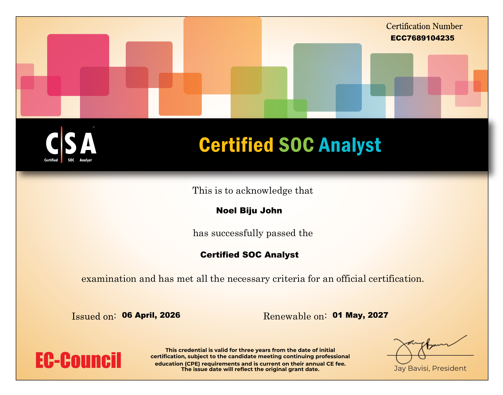

# NOEL BIJU JOHN

SOC Analyst · Detection Engineer · Blue Teamer

## 🛡️ Analyst Assessment Report

| | |
|---|---|
| **Subject** | `noelbijujohn` |
| **Assessment** | Public profile review |
| **Assessor** | You (yes, you — reading this) |
| **Classification** | 🟢 CLEARED — hireable |

### 📋 Findings

*Severity = danger to attackers if he's on your blue team.*

| ID | Finding | Severity | Status |
|----|---------|----------|--------|
| S-01 | Detection engineering — Elastic EQL, KQL & threshold rules, every rule validated against live attacks | 🔴 Critical | ✅ Confirmed |
| S-02 | Network forensics — PCAP teardown: SMB sessions, NTLM auth, lateral movement tracing | 🔴 Critical | ✅ Confirmed |
| S-03 | Log forensics — `auth.log`, `wtmp`, Windows Event Logs, full timeline reconstruction | 🟠 High | ✅ Confirmed |
| S-04 | OSINT investigation — username pivoting, commit metadata extraction, geolocation | 🟠 High | ✅ Confirmed |
| S-05 | Adversary emulation — Kali-based attack simulation to prove detections actually fire | 🟡 Medium | ✅ Confirmed |

### 💥 Case Files

- [**PsExec-Hunt**](https://github.com/Noel-BijuJohn/PsExec-Hunt) — CyberDefenders lab: traced PsExec lateral movement `10.0.0.130` → `SALES-PC` → `MARKETING-PC` across 40k packets; extracted `PSEXESVC.exe` via PDB path; MITRE-mapped with SOC detection takeaways
- [**Cache-Me-Outside-Writeup**](https://github.com/Noel-BijuJohn/Cache-Me-Outside-Writeup) — TryHackMe OSINT room: unmasked a retired hacker from one leaked screenshot via Komoot, GitHub `.patch` metadata and geotagged activity
- [**elastic-detection-engineering-lab**](https://github.com/Noel-BijuJohn/elastic-detection-engineering-lab) — full Elastic SIEM lab from scratch: 3 log sources, 5 validated detection rules, SOC runbook, importable `.ndjson` rules
- [**htb-brutus-ssh-forensics**](https://github.com/Noel-BijuJohn/htb-brutus-ssh-forensics) — HackTheBox Sherlock: SSH brute force, backdoor account and privesc traced from `auth.log` + `wtmp` alone
- [**hawkeye-infostealer-analysis**](https://github.com/Noel-BijuJohn/hawkeye-infostealer-analysis) — HawkEye Reborn v9 infostealer: phishing → execution → Base64 SMTP exfil decoded with CyberChef; C2 attributed (FR + US)
- [**GeoTask**](https://github.com/Noel-BijuJohn/Geotask) — Android geofencing app: Google Maps API + Firebase, geofence-entry push notifications with live inventory matching

### 🏆 Credentials

**EC-Council Certified SOC Analyst (CSA)** — *April 2026*

 

 
Certification No. ECC7689104235 · Issued 06 April 2026

### 🩹 Remediation

No patch available. Recommended action: **hire this analyst**.

🔓 Declassify availability

📍 Kerala, India (IST) · 🟢 Open to SOC / security roles

🧰 Full arsenal

| Category | Tools |
|---|---|
| 🖥️ **SIEM** | Elastic Stack (Kibana, Fleet, Packetbeat, Elasticsearch) · Splunk · Wazuh |
| 🌐 **Network Forensics** | Wireshark · CyberChef · tcpdump · Scapy · VirusTotal |
| 🔴 **Pentesting** | Nmap · Metasploit · SET · Burp Suite · Hydra · Nikto |
| 💻 **Attack Simulation** | Kali Linux · Netcat · curl · nslookup · Gobuster |
| 🧠 **Threat Intel** | VirusTotal · OSINT Framework · MITRE ATT&CK Navigator · Shodan |
| 💬 **Languages** | Python · Kotlin · KQL · EQL · Bash · PowerShell |
| 📐 **Frameworks** | MITRE ATT&CK · Elastic Common Schema (ECS) · Cyber Kill Chain · PTES |
| 🛠️ **Other** | Firebase · Google Maps API · Android (Jetpack) · Git · Docker |

### 📊 Observed activity — last 12 months

 

*🔍 Always learning. Always breaking things. Always figuring out how to detect it.*

